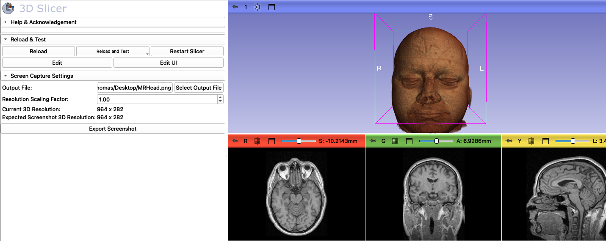

# HiResScreenCapture Module for SlicerMorph

This module is a part of the SlicerMorph extension for 3D Slicer, designed to capture high-resolution screenshots of 3D views within the application. This module is only available for Slicer versions 5.7 or higher, as it relies on some recent changes in core Slicer functionality.

## Usage

1. **Open SlicerMorph:** Launch 3D Slicer and open the SlicerMorph module.

2. **Configure 3D Viewer:** Load the data you would like to render in high-resolution, adjust color and all other properties (i.e, hide the bounding box, or orientation labels, decide to present the scale bar or not).
   
3. **Access the High Resolution Screen Capture Module:**
   - In the SlicerMorph module, navigate to the `Input and Output` dropdown menu.
   - Look for the `HiResScreenCapture` module in the list of available modules.

4. **Configure Settings:**
   - ***Output File**: Specify the path to save the screenshot. You can type the path directly or click `Select Output File` to browse.
   - ***Resolution Scaling Factor**: Use the spin box to set the scaling factor. The range is from 0.1 to 100.0. 
   - ***Current 3D Resolution**: Displays the current resolution of the 3D view.
   - ***Expected Screenshot Resolution**: Displays the resolution of the screenshot based on the scaling factor. For example, if you would like the final output to be image of 10" wide with 600DPI, you need to have the X dimension of the screenshot resolution to be 6000px. You can adjust the scaling factor based on this. 
 
5. **Capture Screenshot:** Click `Export Screenshot` to capture the screenshot with the specified settings.
